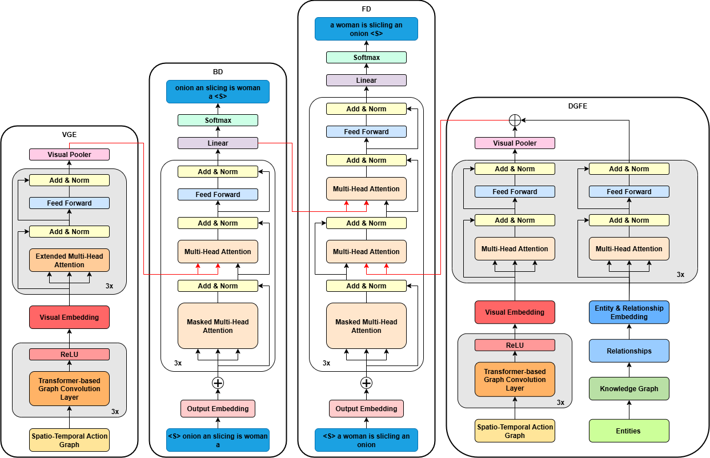

# Integrating Action Graph and Knowledge Graph into Bidirectional Transformer for Video Captioning

## Description

This project implements a video captioning system that integrates both **Action Graph** and **Knowledge Graph** into a **Bidirectional Transformer-based architecture** to generate rich and context-aware descriptions of videos.

- 🔍 **Action Graph** are constructed from visual features to model spatial-temporal object interactions across video frames, enabling the model to capture fine-grained action dynamics.
- 🧠 **Knowledge Graph** are derived from external textual resources (or captions) to provide additional semantic context, supporting the generation of more accurate and informative descriptions.
- 🔁 A **Bidirectional Transformer Decoder** is employed to generate captions in both **left-to-right (L2R)** and **right-to-left (R2L)** directions, allowing the model to fully utilize contextual information in both temporal directions.
- 📊 The system is trained and evaluated on standard video captioning benchmarks such as **MSVD** and **MSR-VTT**, using metrics including BLEU-4, CIDEr, METEOR, and ROUGE-L.



## Prepare the Environment 
Install and create conda environment, which was tested with NVIDIA RTX 3090.
```
conda create --name akg_env python=3.12 -y
pip install torch==2.6.0 torchvision==0.21.0 torchaudio==2.6.0 --index-url https://download.pytorch.org/whl/cu126
pip install pyg_lib torch_scatter torch_sparse torch_cluster torch_spline_conv -f https://data.pyg.org/whl/torch-2.6.0+cu126.html
pip install torch_geometric sparse
pip install pycocoevalcap h5py tensorboardX boto3 requests pandas tqdm nltk ftfy open_clip_torch transformers 
```

## Prepare the Dataset
```bash
├── dataset
│   ├── MSVD
│   │   ├── features
│   │   ├── metadata
│   ├── MSRVTT
│   │   ├── features
│   │   ├── metadata

```
**All feature filenames follow the rule:**
```
/dataset/{DATASET}/features/{DATASET}_{FEATURE_TYPE}_{PHASE}.hdf5
```
   - {DATASET}: MSVD, MSRVTT
   - {FEATURE_TYPE}: GBased, rel, videomask
   - {PHASE}: train, val, test

e.g., MSVD_GBased_train.hdf5

## Extract the Features
### Feature Extractor Folder Structure
```bash
├── model
│   ├── i3d
├── modules # Copy the files from CLIP4Clip repository: https://github.com/ArrowLuo/CLIP4Clip/tree/master/modules
├── pretrained 
│   ├── [trained CLIP4Clip model].bin # Train your own PyTorch CLIP4Clip model
│   ├── rgb_imagenet.pt # Download I3D model: https://github.com/piergiaj/pytorch-i3d/blob/master/models/rgb_imagenet.pt
├── utility # Some helper functions to generate the features
```

**Note** 
```
- Please make sure you have copied modules from CLIP4Clip https://github.com/ArrowLuo/CLIP4Clip/tree/master/modules into STGraph/modules.
- Please make sure you have downloaded rgb_imagenet.pt into STGraph/pretrained.
- Please change args in each notebook based on requirement e.g,. args.msvd = False for MSR-VTT and args.msvd = True for MSVD.
```

### Train CLIP4Clip
Train CLIP4Clip based on https://github.com/ArrowLuo/CLIP4Clip and put the best model in the **pretrained** folder.
   - For MSR-VTT, we use 6513 clips for training, 497 clips for validation and 2990 clips for test when training the CLIP4Clip.
   - For MSVD, we use 1200 clips for training, 100 clips for validation and 670 clips for test when training the CLIP4Clip.
### Grid Based Action Graph

Steps:
1. Extract grid node by using **grid_node_feature_extractor.py**.
2. Extract spatial action graph by using **grid_based_spatial_action_graph.py**.
3. Extract temporal action graph by using **temporal_similarity_graph.py**.
4. Create the grid based action graph: 
   - run **action_spatio_temporal_graph_feature_extractor.py** then ,
   - run **transform-graph-to-geometric.py**

### Knowledge Graph

## Training
Control how relation features are processed using the `--attention` flag:
   - `--attention 1`: **MHA**  
   - `--attention 2`: **MHA + PE**  
   - `--attention 3`: **Baseline**

**Example usage:**
```
N_GPU=[Total GPU to use]
N_THREAD=[Total thread to use]
MODE=MSR-VTT_GBased+rel+videomask
OMP_NUM_THREADS=$N_THREAD torchrun --nproc_per_node=$N_GPU --master_port=12345  main.py --model_name $MODE --attention 1 --do_train
```
